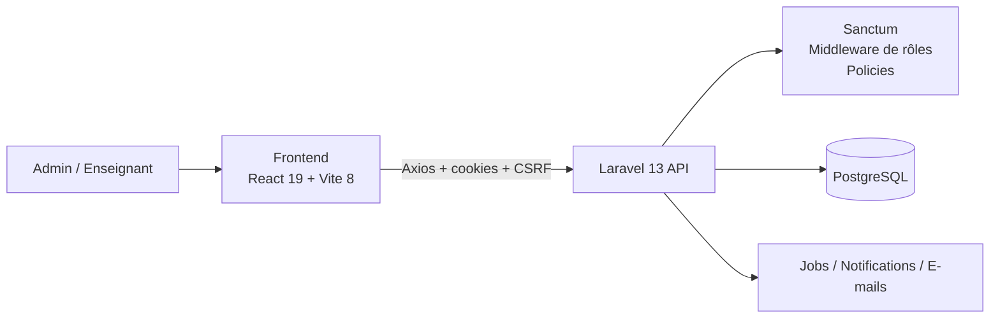

<div align="center">

# SGA-BTS

### Système de Gestion des Absences pour BTS

Application web full-stack destinée à la gestion académique et au suivi des absences au sein d'un établissement BTS.

[](https://laravel.com/)
[](https://www.php.net/)
[](https://www.postgresql.org/)
[](https://react.dev/)
[](https://vite.dev/)
[](https://tailwindcss.com/)

</div>

---

## À propos

**SGA-BTS** est une application de gestion des absences conçue pour centraliser les principales opérations liées au suivi académique d'un établissement BTS.

Le projet sépare le **frontend React** du **backend Laravel API** et s'appuie sur **PostgreSQL** pour la persistance des données. Il propose deux rôles applicatifs authentifiés : **administrateur** et **enseignant**.

Le système couvre notamment la gestion des étudiants, enseignants, filières, classes, matières, années académiques, inscriptions, affectations, séances, absences, justifications, notifications et statistiques.

> **Remarque :** dans la version actuelle, les étudiants sont des entités gérées par l'établissement ; ils ne disposent pas d'un rôle de connexion dédié.

---

## Fonctionnalités

### Administration

- Gestion des étudiants
- Gestion des enseignants
- Gestion des filières
- Gestion des classes
- Gestion des matières
- Gestion des années académiques
- Gestion des inscriptions
- Affectation des enseignants aux classes et années académiques
- Gestion des séances
- Consultation et gestion des absences
- Gestion des justifications
- Notification d'un étudiant à partir d'une absence
- Import des étudiants depuis des fichiers **XLSX, XLS ou CSV**
- Import des enseignants avec génération d'invitations
- Prévisualisation des données avant import
- Gestion des notifications internes
- Tableau de bord et statistiques académiques

### Enseignants

- Authentification via compte enseignant
- Activation du compte via invitation
- Consultation des classes et étudiants accessibles
- Création et gestion des séances
- Enregistrement des absences d'une séance
- Consultation et modification des absences autorisées
- Tableau de bord enseignant
- Statistiques par période, classe et étudiant

### Profil et compte

- Modification des informations personnelles
- Téléversement et suppression d'un avatar
- Modification de l'adresse e-mail avec vérification
- Modification du mot de passe
- Désactivation des comptes utilisateurs côté administration

---

## Tableaux de bord

### Tableau de bord administrateur

Le tableau de bord administrateur fournit notamment :

- nombre total d'absences ;
- nombre d'étudiants inscrits pour l'année académique sélectionnée ;
- nombre d'enseignants affectés ;
- absences de la veille ;
- absences de la semaine ;
- absences du mois ;
- absences de l'année ;
- répartition des absences par classe ;
- répartition des absences justifiées / non justifiées ;
- absences par enseignant et matière ;
- étudiant avec le plus grand volume d'heures d'absence ;
- alerte lorsqu'un étudiant dépasse le seuil configuré ;
- alerte en cas d'absences sur plusieurs séances consécutives.

Les valeurs par défaut sont configurées dans `backend/config/absences.php` :

```text
Seuil d'absence : 480 minutes
Alerte d'absences consécutives : 4 séances
```

### Tableau de bord enseignant

Le tableau de bord enseignant présente notamment :

- séances créées ;
- absences du jour ;
- absences de la semaine ;
- absences du mois ;
- absences de l'année ;
- taux global de présence ;
- classes les plus absentes ;
- étudiants les plus absents.

---

## Architecture



Le backend utilise notamment :

- Controllers
- Form Requests
- API Resources
- Services
- Repositories
- Policies
- Middleware
- Enums
- Jobs
- Eloquent Models

Le frontend utilise notamment :

- React Router
- Axios
- React Hook Form
- Zod
- Recharts
- Tailwind CSS
- shadcn
- Sonner
- Lucide React

---

## Stack technique

| Couche | Technologies |
|---|---|
| Backend | Laravel 13, PHP |
| Authentification | Laravel Sanctum |
| Base de données | PostgreSQL |
| Import de fichiers | Maatwebsite Excel |
| Frontend | React 19 |
| Build tool | Vite 8 |
| UI | Tailwind CSS 4, shadcn |
| Formulaires | React Hook Form |
| Validation frontend | Zod |
| Requêtes HTTP | Axios |
| Graphiques | Recharts |
| Routing frontend | React Router |
| Icônes | Lucide React |

---

## Contrôle d'accès et sécurité applicative

La version actuelle intègre plusieurs mécanismes de protection :

- authentification stateful avec Laravel Sanctum ;
- protection CSRF pour les requêtes du frontend ;
- limitation du endpoint de connexion à `10` tentatives par minute ;
- séparation des rôles `admin` et `teacher` ;
- middleware de contrôle des rôles ;
- Policies Laravel sur les principales ressources ;
- invalidation de session lorsqu'un compte devient inactif ;
- validation serveur via Form Requests ;
- invitations temporaires pour l'activation des comptes enseignants ;
- restrictions sur les opérations liées aux séances et aux absences.

Les autorisations sensibles restent validées côté backend ; le frontend ne constitue pas la barrière de sécurité principale.

---

## Structure du projet

```text
SGA-BTS/
├── backend/
│   ├── app/
│   │   ├── Enums/
│   │   ├── Http/
│   │   │   ├── Controllers/
│   │   │   ├── Middleware/
│   │   │   ├── Requests/
│   │   │   └── Resources/
│   │   ├── Jobs/
│   │   ├── Models/
│   │   ├── Policies/
│   │   ├── Repositories/
│   │   └── Services/
│   ├── config/
│   ├── database/
│   │   ├── factories/
│   │   ├── migrations/
│   │   └── seeders/
│   ├── routes/
│   └── tests/
│
├── frontend/
│   ├── src/
│   │   ├── components/
│   │   ├── contexts/
│   │   ├── hooks/
│   │   ├── lib/
│   │   ├── pages/
│   │   ├── router/
│   │   ├── schemas/
│   │   └── services/
│   └── package.json
│
└── README.md
```

---

## Prérequis

Avant de lancer le projet, installez :

- **PHP 8.4 recommandé** pour le lockfile actuel ;
- Composer ;
- PostgreSQL ;
- Node.js compatible avec les dépendances du lockfile ;
- npm ;
- Git.

### À propos des versions PHP et Node.js

Le fichier `backend/composer.json` déclare actuellement `php: ^8.3`, mais l'arbre de dépendances verrouillé peut nécessiter **PHP 8.4**. Si `composer install` échoue sous PHP 8.3 avec une contrainte provenant de Symfony 8, utilisez PHP 8.4.

Avec l'arbre npm actuel, certaines versions de Node.js peuvent également produire un avertissement `EBADENGINE`. Une version récente satisfaisant les contraintes des dépendances est recommandée.

---

## Installation locale

### 1. Cloner le dépôt

```bash
git clone https://github.com/HichamFaska/SGA-BTS.git
cd SGA-BTS
```

---

### 2. Préparer PostgreSQL

Créez une base de données et un utilisateur PostgreSQL adaptés à votre environnement.

Exemple :

```sql
CREATE USER sga_user WITH PASSWORD 'change_me';
CREATE DATABASE sga_bts OWNER sga_user;
```

---

### 3. Installer et configurer le backend

```bash
cd backend
composer install
```

Créez le fichier `.env`.

Linux / macOS :

```bash
cp .env.example .env
```

Windows PowerShell :

```powershell
Copy-Item .env.example .env
```

Configurez au minimum les variables suivantes :

```env
APP_NAME="SGA BTS"
APP_ENV=local
APP_DEBUG=true
APP_URL=http://localhost:8000

FRONTEND_URL=http://localhost:5173

DB_CONNECTION=pgsql
DB_HOST=127.0.0.1
DB_PORT=5432
DB_DATABASE=sga_bts
DB_USERNAME=sga_user
DB_PASSWORD=change_me

SESSION_DOMAIN=localhost
SANCTUM_STATEFUL_DOMAINS=localhost:5173,127.0.0.1:5173

ADMIN_EMAIL=admin@example.com
ADMIN_PASSWORD=change_me
```

Générez la clé de l'application :

```bash
php artisan key:generate
```

Exécutez les migrations et les seeders :

```bash
php artisan migrate --seed
```

Créez le lien de stockage public pour les avatars :

```bash
php artisan storage:link
```

Démarrez le backend :

```bash
php artisan serve --host=localhost --port=8000
```

Le backend est alors accessible sur :

```text
http://localhost:8000
```

---

### 4. Installer et configurer le frontend

Ouvrez un second terminal :

```bash
cd frontend
npm install
```

Créez le fichier `.env`.

Linux / macOS :

```bash
cp .env.example .env
```

Windows PowerShell :

```powershell
Copy-Item .env.example .env
```

Configuration par défaut :

```env
VITE_API_BASE_URL=http://localhost:8000
VITE_APP_NAME=BTS
```

Vérifiez le build :

```bash
npm run build
```

Puis démarrez le serveur de développement :

```bash
npm run dev
```

Le frontend est accessible sur :

```text
http://localhost:5173
```

---

## Données de démonstration

Le `DatabaseSeeder` actuel exécute :

- `AdminUserSeeder`
- `TeacherSeeder`
- `StudentSeeder`

Il crée par défaut :

- `1` compte administrateur ;
- `10` enseignants ;
- `50` étudiants.

Les identifiants administrateur proviennent de :

```env
ADMIN_EMAIL=
ADMIN_PASSWORD=
```

Le fichier `.env.example` utilise actuellement :

```text
admin@example.com
password
```

> Ces identifiants sont uniquement adaptés au développement local. Changez-les avant tout environnement partagé ou exposé.

---

## Première utilisation

Après une installation fraîche, les seeders actuels **ne créent pas d'année académique**.

Avant d'utiliser pleinement le tableau de bord administrateur :

1. connectez-vous avec le compte administrateur ;
2. ouvrez **Années académiques** ;
3. créez une année, par exemple `2026-2027` ;
4. définissez-la comme **année en cours** ;
5. configurez ensuite les filières, matières et classes ;
6. inscrivez les étudiants ;
7. affectez les enseignants ;
8. créez les séances ;
9. enregistrez les absences.

Workflow recommandé :

```text
Année académique
        ↓
Filières + Matières
        ↓
Classes
        ↓
Inscriptions des étudiants
        ↓
Affectations des enseignants
        ↓
Séances
        ↓
Absences + Justifications
        ↓
Statistiques
```

---

## Import Excel / CSV

L'administration peut importer des étudiants et des enseignants depuis :

- `.xlsx`
- `.xls`
- `.csv`

Taille maximale actuellement validée côté backend :

```text
5 Mo
```

Le système propose une étape de prévisualisation avant l'import définitif.

Pour les étudiants, les colonnes reconnues incluent notamment :

```text
matricule
first_name / prenom
last_name / nom
birth_date / naissance
email / mail
phone / telephone
address / adresse
```

Pour les enseignants, l'e-mail est requis lors de l'import afin de créer le compte utilisateur et l'invitation associée.

---

## Commandes utiles

### Backend

```bash
composer install
php artisan migrate --seed
php artisan serve
composer test
```

### Frontend

```bash
npm install
npm run dev
npm run build
npm run lint
npm run preview
```

---

## Vérification rapide de l'installation

Backend :

```bash
php artisan migrate:status
```

Frontend :

```bash
npm run build
```

Application :

```text
Frontend : http://localhost:5173
Backend  : http://localhost:8000
Health   : http://localhost:8000/up
```

---

## Contribution

Les contributions peuvent être proposées via Pull Request.

Workflow recommandé :

```bash
git fork / clone
git checkout -b docs/improve-readme
# effectuer les modifications
git add .
git commit -m "docs: improve project documentation"
git push origin docs/improve-readme
```

Ouvrez ensuite une Pull Request vers la branche `main` du dépôt principal.

Pour faciliter la revue :

- gardez chaque Pull Request centrée sur un objectif précis ;
- décrivez clairement ce qui a changé ;
- évitez de mélanger documentation, refactoring et nouvelles fonctionnalités dans la même PR ;
- vérifiez le build avant soumission.

---

## Mainteneur

Projet hébergé sur GitHub par [@HichamFaska](https://github.com/HichamFaska).

---

<div align="center">

**SGA-BTS — Gestion académique et suivi des absences**

</div>
