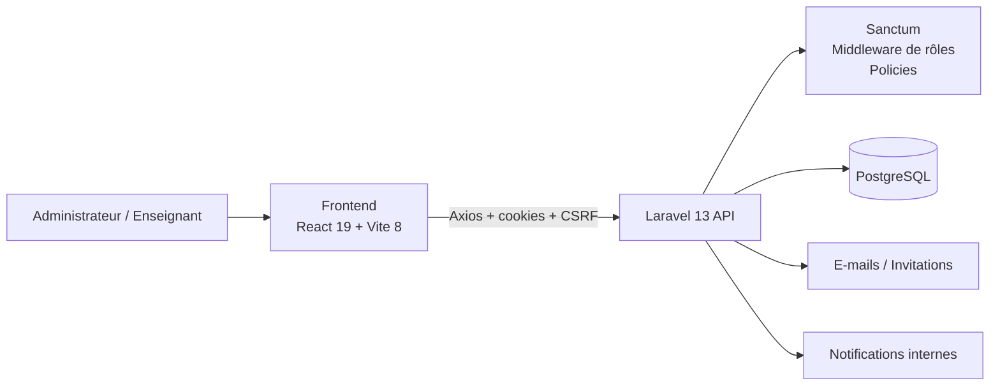

<div align="center">

# SGA-BTS

### Système de Gestion des Absences pour BTS

Application web full-stack de gestion académique et de suivi des absences pour un établissement BTS.

[](https://laravel.com/)
[](https://www.php.net/)
[](https://www.postgresql.org/)
[](https://react.dev/)
[](https://vite.dev/)
[](https://tailwindcss.com/)

</div>

---

## À propos

**SGA-BTS** est une application web conçue pour centraliser le suivi des absences et plusieurs opérations de gestion académique d'un établissement BTS.

Le projet est organisé en deux applications distinctes :

- un **backend Laravel API** ;
- un **frontend React**.

La persistance des données repose sur **PostgreSQL**.

La version actuelle gère deux rôles applicatifs authentifiés :

- **Administrateur**
- **Enseignant**

Les étudiants sont gérés comme des entités académiques et **ne disposent pas d'un compte de connexion dédié** dans l'implémentation actuelle.

---

## Fonctionnalités principales

### Administration

L'administrateur peut notamment :

- gérer les étudiants ;
- gérer les enseignants ;
- gérer les filières ;
- gérer les classes ;
- gérer les matières ;
- gérer les années académiques ;
- gérer les inscriptions des étudiants ;
- gérer les affectations des enseignants aux classes et années académiques ;
- créer, consulter, modifier et supprimer des séances selon les autorisations prévues ;
- consulter et gérer les absences ;
- gérer les justifications ;
- activer ou désactiver les comptes enseignants ;
- renvoyer une invitation à un enseignant ;
- importer des étudiants depuis des fichiers **XLSX, XLS ou CSV** ;
- importer des enseignants depuis des fichiers **XLSX, XLS ou CSV** ;
- prévisualiser les données avant import ;
- consulter les notifications internes liées aux appels et aux absences ;
- marquer les notifications comme lues ;
- envoyer manuellement un rappel d'absence par e-mail à un étudiant ;
- consulter les statistiques académiques du tableau de bord.

### Enseignants

Un enseignant peut notamment :

- se connecter avec son compte ;
- activer son compte via une invitation lorsqu'il est créé par ce mécanisme ;
- consulter les ressources auxquelles son rôle donne accès ;
- consulter et gérer ses séances selon les règles d'autorisation ;
- effectuer l'appel d'une séance ;
- enregistrer les absences d'une séance ;
- consulter les absences ;
- modifier ou supprimer les absences qu'il est autorisé à gérer ;
- consulter son tableau de bord et ses statistiques.

### Profil et compte

Les utilisateurs authentifiés peuvent notamment :

- modifier leurs informations personnelles ;
- téléverser ou supprimer un avatar ;
- demander la modification de leur adresse e-mail ;
- confirmer une nouvelle adresse e-mail via un code de vérification ;
- modifier leur mot de passe.

---

## Tableaux de bord

### Tableau de bord administrateur

Le tableau de bord administrateur exploite l'année académique sélectionnée et présente notamment :

- le nombre total d'absences ;
- le nombre d'étudiants inscrits ;
- le nombre d'enseignants affectés ;
- les absences de la veille ;
- les absences de la semaine ;
- les absences du mois ;
- les absences de l'année ;
- les absences par classe ;
- la répartition entre absences justifiées et non justifiées ;
- les absences par enseignant et matière ;
- l'étudiant ayant le plus grand volume d'heures d'absence ;
- le nombre d'étudiants dépassant le seuil d'absence configuré ;
- les alertes liées aux absences sur plusieurs séances consécutives.

Les valeurs par défaut sont définies dans `backend/config/absences.php` :

```text
Seuil d'absence : 480 minutes
Alerte d'absences consécutives : 4 séances
```

### Tableau de bord enseignant

Le tableau de bord enseignant présente notamment :

- le nombre de séances créées sur l'année académique courante ;
- les absences du jour ;
- les absences de la semaine ;
- les absences du mois ;
- les absences de l'année ;
- le taux global de présence ;
- les classes les plus absentes ;
- les étudiants les plus absents.

---

## Architecture



Le backend utilise notamment :

- Controllers ;
- Form Requests ;
- API Resources ;
- Services ;
- Repositories ;
- Policies ;
- Middleware ;
- Enums ;
- Jobs ;
- Eloquent Models.

Le frontend utilise notamment :

- React Router ;
- Axios ;
- React Hook Form ;
- Zod ;
- Recharts ;
- Tailwind CSS ;
- shadcn ;
- Sonner ;
- Lucide React.

---

## Stack technique

| Couche | Technologies |
|---|---|
| Backend | Laravel 13, PHP |
| Authentification | Laravel Sanctum |
| Base de données | PostgreSQL |
| Import de fichiers | Maatwebsite Excel |
| Frontend | React 19 |
| Build tool | Vite 8 |
| UI | Tailwind CSS 4, shadcn |
| Formulaires | React Hook Form |
| Validation frontend | Zod |
| Requêtes HTTP | Axios |
| Graphiques | Recharts |
| Routing frontend | React Router |
| Icônes | Lucide React |

---

## Contrôle d'accès et sécurité applicative

La version actuelle intègre plusieurs mécanismes de sécurité applicative :

- authentification stateful avec **Laravel Sanctum** ;
- protection CSRF utilisée par le frontend ;
- limitation du endpoint de connexion à **10 tentatives par minute** ;
- séparation des rôles `admin` et `teacher` ;
- middleware de contrôle des rôles ;
- Policies Laravel pour contrôler l'accès à plusieurs ressources ;
- vérification du statut actif ou inactif des utilisateurs ;
- invalidation de la session lorsqu'un compte authentifié est désactivé ;
- régénération de session après authentification ;
- invalidation de session et régénération du token CSRF à la déconnexion ;
- validation serveur via Form Requests ;
- contrôle des actions sensibles liées aux séances et aux absences ;
- invitations temporaires pour l'activation des comptes enseignants ;
- validation des fichiers d'import ;
- limitation de l'envoi répété d'un rappel d'absence par e-mail.

> Le frontend applique des contrôles d'affichage et de navigation, mais les autorisations sensibles restent validées côté backend.

---

## Structure du projet

```text
SGA-BTS/
├── backend/
│   ├── app/
│   │   ├── Enums/
│   │   ├── Http/
│   │   │   ├── Controllers/
│   │   │   ├── Middleware/
│   │   │   ├── Requests/
│   │   │   └── Resources/
│   │   ├── Jobs/
│   │   ├── Models/
│   │   ├── Policies/
│   │   ├── Repositories/
│   │   └── Services/
│   ├── config/
│   ├── database/
│   │   ├── factories/
│   │   ├── migrations/
│   │   └── seeders/
│   ├── routes/
│   └── tests/
│
├── frontend/
│   ├── src/
│   │   ├── components/
│   │   ├── contexts/
│   │   ├── hooks/
│   │   ├── lib/
│   │   ├── pages/
│   │   ├── router/
│   │   ├── schemas/
│   │   └── services/
│   └── package.json
│
└── README.md
```

---

## Prérequis

Pour reproduire l'environnement correspondant au lockfile actuel, prévoyez :

- **PHP 8.4** ;
- Composer ;
- PostgreSQL ;
- **Node.js 24.15+ recommandé sur la branche 24.x** ;
- npm ;
- Git.

### Compatibilité PHP

`backend/composer.json` déclare actuellement :

```text
php: ^8.3
```

Cependant, avec le `composer.lock` actuel, certaines dépendances verrouillées nécessitent PHP 8.4. Pour une installation reproductible avec l'état actuel du dépôt, **PHP 8.4 est donc recommandé**.

### Compatibilité Node.js

Avec certaines versions de Node.js légèrement antérieures, `npm install` peut afficher un avertissement `EBADENGINE` provenant d'une dépendance transitive.

Une version **Node.js 24.15 ou plus récente dans la branche 24.x** évite la contrainte observée avec le lockfile actuel.

---

## Installation locale

### 1. Cloner le dépôt

```bash
git clone https://github.com/HichamFaska/SGA-BTS.git
cd SGA-BTS
```

---

### 2. Préparer PostgreSQL

Créez une base de données PostgreSQL et un utilisateur dédié.

Exemple :

```sql
CREATE USER sga_user WITH PASSWORD 'change_me';
CREATE DATABASE sga_bts OWNER sga_user;
```

Adaptez les noms et mots de passe à votre environnement.

---

### 3. Installer et configurer le backend

```bash
cd backend
composer install
```

Créez le fichier `.env`.

#### Linux / macOS

```bash
cp .env.example .env
```

#### Windows PowerShell

```powershell
Copy-Item .env.example .env
```

Configurez au minimum les paramètres suivants :

```env
APP_NAME="SGA BTS"
APP_ENV=local
APP_DEBUG=true
APP_URL=http://localhost:8000

FRONTEND_URL=http://localhost:5173

DB_CONNECTION=pgsql
DB_HOST=127.0.0.1
DB_PORT=5432
DB_DATABASE=sga_bts
DB_USERNAME=sga_user
DB_PASSWORD=change_me

SESSION_DOMAIN=localhost
SANCTUM_STATEFUL_DOMAINS=localhost:5173,127.0.0.1:5173

ADMIN_EMAIL=admin@example.com
ADMIN_PASSWORD=change_me
```

Générez la clé de l'application :

```bash
php artisan key:generate
```

Exécutez les migrations et les seeders :

```bash
php artisan migrate --seed
```

Créez le lien vers le stockage public utilisé notamment pour les avatars :

```bash
php artisan storage:link
```

Démarrez le backend :

```bash
php artisan serve --host=localhost --port=8000
```

Le serveur Laravel sera accessible sur :

```text
http://localhost:8000
```

L'API est exposée sous :

```text
http://localhost:8000/api
```

Le endpoint de santé Laravel est disponible sur :

```text
http://localhost:8000/up
```

---

### 4. Installer et configurer le frontend

Ouvrez un second terminal depuis la racine du projet :

```bash
cd frontend
npm install
```

Créez le fichier `.env`.

#### Linux / macOS

```bash
cp .env.example .env
```

#### Windows PowerShell

```powershell
Copy-Item .env.example .env
```

Le fichier `frontend/.env.example` utilise :

```env
VITE_API_BASE_URL=http://localhost:8000
VITE_APP_NAME=BTS
```

Vérifiez que le frontend se construit correctement :

```bash
npm run build
```

Puis démarrez le serveur de développement :

```bash
npm run dev
```

Le frontend est accessible sur :

```text
http://localhost:5173
```

---

## E-mails et file d'attente

Le projet utilise les e-mails pour plusieurs flux, notamment :

- invitation d'un enseignant ;
- vérification d'une nouvelle adresse e-mail ;
- rappel manuel d'absence envoyé à un étudiant.

Dans `.env.example`, le mailer par défaut est :

```env
MAIL_MAILER=log
```

Avec cette configuration, les e-mails sont écrits dans les logs au lieu d'être envoyés à un serveur SMTP réel.

Pour envoyer de vrais e-mails, configurez les variables `MAIL_*` avec votre fournisseur SMTP.

Le projet utilise également :

```env
QUEUE_CONNECTION=database
```

L'import en masse des enseignants déclenche des jobs d'envoi d'invitation. Pour traiter ces jobs, gardez un worker actif :

```bash
php artisan queue:work
```

---

## Données de démonstration

Le `DatabaseSeeder` actuel exécute :

- `AdminUserSeeder`
- `TeacherSeeder`
- `StudentSeeder`

Il crée par défaut :

- **1 administrateur** ;
- **10 enseignants** ;
- **50 étudiants**.

### Compte administrateur

Les identifiants proviennent des variables :

```env
ADMIN_EMAIL=
ADMIN_PASSWORD=
```

Le `.env.example` fournit actuellement comme valeurs de développement :

```text
admin@example.com
password
```

### Comptes enseignants générés par les factories

Les comptes utilisateurs créés par `UserFactory` pour les enseignants utilisent le mot de passe de développement :

```text
bts@2026
```

Les adresses e-mail sont générées par Faker.

> Les identifiants ci-dessus sont destinés au développement local. Ils doivent être remplacés dans tout environnement partagé ou exposé.

---

## Configuration initiale importante

Après une installation fraîche, les seeders actuels **ne créent pas d'année académique**.

Le tableau de bord et plusieurs calculs statistiques dépendent d'une année académique courante.

Après la première connexion administrateur :

1. ouvrez **Années académiques** ;
2. créez une année académique ;
3. définissez-la comme **année en cours** ;
4. créez ou configurez les filières ;
5. créez les matières ;
6. créez les classes ;
7. inscrivez les étudiants ;
8. affectez les enseignants aux classes et à l'année académique ;
9. créez les séances ;
10. enregistrez les absences.

Workflow fonctionnel recommandé :

```text
Année académique
        ↓
Filières + Matières
        ↓
Classes
        ↓
Inscriptions des étudiants
        ↓
Affectations des enseignants
        ↓
Séances
        ↓
Appel / Absences
        ↓
Justifications
        ↓
Statistiques et alertes
```

---

## Import Excel / CSV

L'administration peut importer des étudiants et des enseignants depuis :

- `.xlsx`
- `.xls`
- `.csv`

La taille maximale validée côté backend pour le fichier de prévisualisation est actuellement :

```text
5 Mo
```

Une étape de prévisualisation permet d'analyser les données avant l'import définitif.

### Colonnes reconnues pour les étudiants

Le normaliseur accepte notamment :

```text
matricule
first_name / prenom
last_name / nom
birth_date / naissance
email / mail
phone / telephone
address / adresse
```

### Colonnes reconnues pour les enseignants

Le normaliseur accepte notamment :

```text
matricule
first_name / prenom
last_name / nom
email / mail
birth_date / naissance
phone / telephone
address / adresse
```

Pour les enseignants, l'adresse e-mail est requise lors de l'import définitif afin de créer le compte utilisateur et l'invitation associée.

---

## Règles métier importantes

Quelques règles présentes dans l'implémentation actuelle :

- un enseignant ne peut effectuer l'appel que pour une séance qui lui appartient ;
- l'appel d'une séance ne peut être enregistré qu'avant que `called_at` soit défini ;
- après l'appel, les absences de la séance sont enregistrées et la séance reçoit un horodatage `called_at` ;
- un enseignant ne peut modifier ou supprimer que les absences qu'il est autorisé à gérer ;
- l'administrateur dispose de droits plus larges sur les absences et leur statut ;
- les utilisateurs inactifs ne peuvent pas se connecter ;
- une session active est invalidée si le compte devient inactif ;
- le rappel manuel d'absence envoyé à un étudiant est limité afin d'éviter les envois répétés immédiats.

---

## Commandes utiles

### Backend

```bash
composer install
php artisan migrate --seed
php artisan migrate:status
php artisan storage:link
php artisan serve
php artisan queue:work
composer test
```

### Frontend

```bash
npm install
npm run dev
npm run build
npm run lint
npm run preview
```

---

## Vérification rapide de l'installation

### Backend

```bash
php artisan migrate:status
```

### Frontend

```bash
npm run build
```

### Endpoints locaux

```text
Frontend : http://localhost:5173
Backend  : http://localhost:8000
API      : http://localhost:8000/api
Health   : http://localhost:8000/up
```

---

## Mainteneur

Projet hébergé sur GitHub par [@HichamFaska](https://github.com/HichamFaska).

---

<div align="center">

**SGA-BTS — Gestion académique et suivi des absences**

</div>
